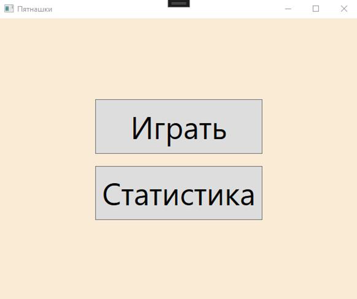
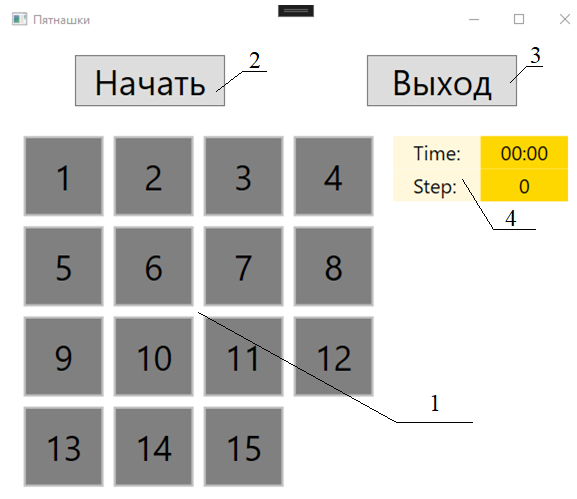
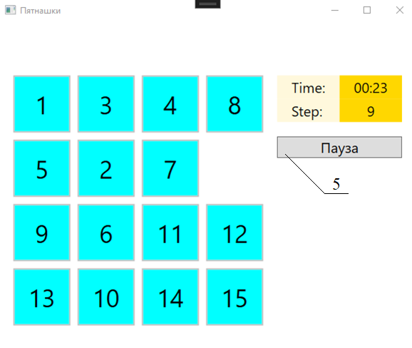
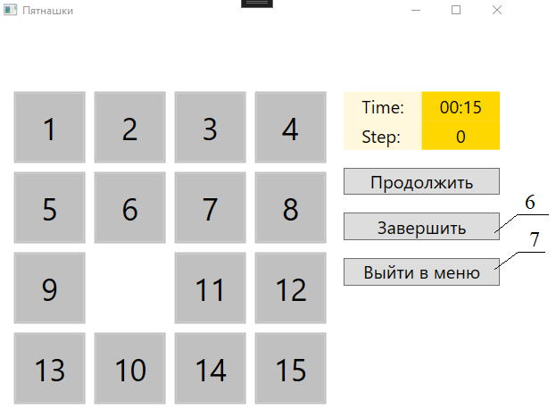
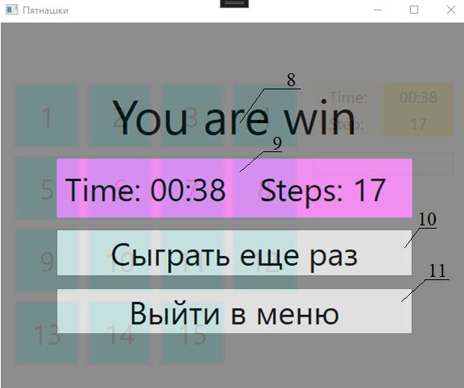
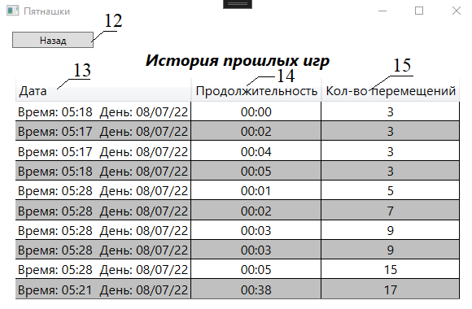

# Учебная практика (4 семестр)

## Задание
Требуется разработать программу, реализующую игру в «15».  
Разработка будет происходить в операционной системе Windows 10 с использованием языка программирования C# и интегрированной среды разработки Visual Studio 2022 Community Edition. Для создания графической части приложения будет использоваться технология WPF (Windows Presentation Foundation) и шаблон проектирования MVVM.

## Готовая программа
### Меню игры  
  

### Представление игры перед началом  
  

 

### Внешний вид в процессе игры  
 

  

### Игра на паузе  
  

 

### Окно победы  
  

 

### История игр  
  